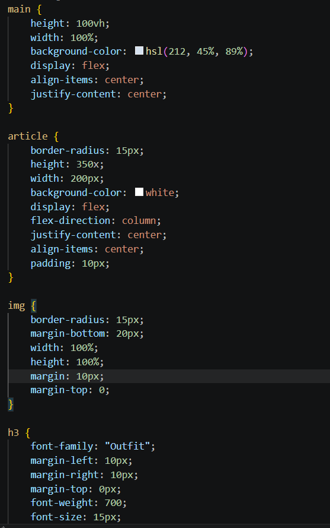
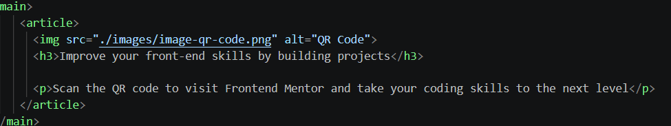

# Frontend Mentor - QR code component solution

This is a solution to the [QR code component challenge on Frontend Mentor](https://www.frontendmentor.io/challenges/qr-code-component-iux_sIO_H). Frontend Mentor challenges help you improve your coding skills by building realistic projects. 

## Table of contents

- [Overview](#overview)
  - [Screenshot](#screenshot)
  - [Links](#links)
- [My process](#my-process)
  - [Built with](#built-with)
  - [What I learned](#what-i-learned)
  - [Continued development](#continued-development)
  - [Useful resources](#useful-resources)
  - [AI Collaboration](#ai-collaboration)
- [Author](#author)
- [Acknowledgments](#acknowledgments)

**Note: Delete this note and update the table of contents based on what sections you keep.**

## Overview

### Screenshot







**Note: Delete this note and the paragraphs above when you add your screenshot. If you prefer not to add a screenshot, feel free to remove this entire section.**

### Links

- Solution URL: https://github.com/jancanare/qr-code-component-main
- Live Site URL: https://jancanare.github.io/qr-code-component-main/

## My process

### Built with

- Semantic HTML5 markup
- CSS custom properties
- Flexbox
- Mobile-first workflow


### What I learned

I already know these but some css properties were refreshed in my mind, like the flexbox, using 100% on width and customizing fonts.

```html
<article>
         
         <h3>Improve your front-end skills by building projects</h3>

         <p>Scan the QR code to visit Frontend Mentor and take your coding skills to the next level</p>
</article>
```
```css
article {
    border-radius: 15px;
    height: 350x;
    width: 200px;
    background-color: white;
    display: flex;
    flex-direction: column;
    justify-content: center;
    align-items: center;
    padding: 10px;
}
```


### Continued development

I want to use what I learned here to further develop my shopify liquid custom section skills.


### AI Collaboration

Describe how you used AI tools (if any) during this project. This helps demonstrate your ability to work effectively with AI assistants.

- What tools did you use (e.g., ChatGPT, Claude, GitHub Copilot)?
  Claude
- How did you use them (e.g., debugging, generating boilerplate, brainstorming solutions)?
  I used it to know how to properly use html tags like <main>, <article> and <section> instead of standard divs
- What worked well? What didn't?
  Most of the stuff worked well, and it didn't want to shift into other topics


## Author

- Frontend Mentor - [@yourusername](https://www.frontendmentor.io/profile/jancanare)
- Twitter - [@yourusername](https://www.twitter.com/yourusername)


